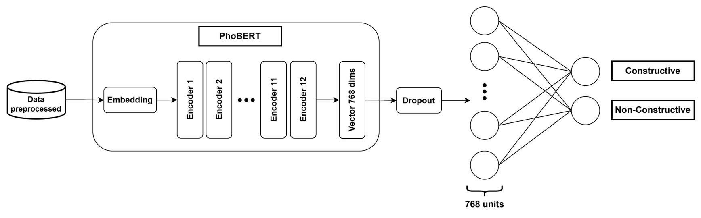
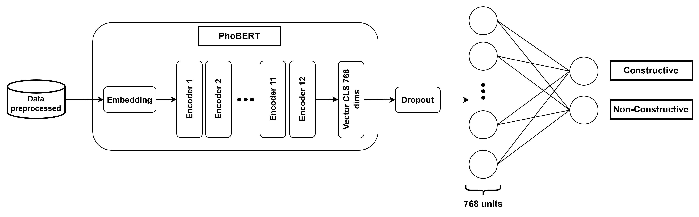

# Phân loại bình luận mang tính xây dựng bằng bộ dữ liệu UIT-ViCTSD
Repo này trình bày chi tiết toàn bộ quy trình từ preprocessing, embedding, training model, đánh giá các mô hình Machine Learning và Deep Learning. Bên cạnh đó, repo này cũng chứa source code của app demo [app](./app.py).
* Slide: [Link slide]()
* Report: [Link report]()

## I. Data Overview
Thống kê bộ dữ liệu:

| Dataset | No. Samples | Avg. Length | Vocab Size | No. words in Test/Val not in Train set |
|:----------:|:--------:|:-------:|:-------:|:---------:|
| [Train](./Data/Original/ViCTSD_train.csv) | 7000 | 29.22 | 14410 | - |
| [Val](./Data/Original/ViCTSD_valid.csv) | 2000 | 30.19 | 7399 | 2535 |
| [Test](./Data/Original/ViCTSD_test.csv) | 1000 | 28.92 | 4581 | 1101 |
| Full | 10000 | 29.38 | 17945 | - |

## II. Preprocessing
Quy trình tiền xử lý dữ liệu đóng vai trò quan trọng để chuẩn hóa văn bản tiếng Việt trước khi đưa vào mô hình.

**Sơ đồ quy trình xử lý chung:**

### Các bước thực hiện chi tiết:

1.  **VietnameseTextCleaner:**
    * Sử dụng Regex đơn giản để làm sạch văn bản.
    * Loại bỏ: HTML tags, Emoji, URL, Email, Số điện thoại, Hashtags và các ký tự nhiễu khác.

2.  **VietnameseToneNormalizer:**
    * Chuẩn hóa bảng mã Unicode (ví dụ: đảm bảo tính nhất quán giữa các ký tự nhìn giống nhau nhưng khác mã).
    * Chuẩn hóa kiểu bỏ dấu câu (ví dụ: chuyển `lựơng` $\rightarrow$ `lượng`, `hài hoà` $\rightarrow$ `hài hòa`).

3.  **Word Segmentation (Tách từ):**
    * Sử dụng thư viện **[VnCoreNLP](https://github.com/vncorenlp/VnCoreNLP)** để tách từ tiếng Việt.
    * **Lý do lựa chọn:** PhoBERT sử dụng *RDRSegmenter* của VnCoreNLP trong quá trình pre-training. Việc sử dụng cùng một công cụ tách từ giúp đảm bảo tính tương thích tốt nhất cho mô hình ([Tham khảo Note của PhoBERT](https://github.com/VinAIResearch/PhoBERT#-notes)).

### Example
> **Input:** “Kịch tính hơn phim hành động, kinh thiệt, buôn bán ma tuý bất chấp tất cả. Chúc các chiến sĩ cảnh sát mạnh khỏe bình an! :)).”
>
> **Output:** “kịch_tính hơn phim hành_động kinh thiệt buôn_bán ma_tuý bất_chấp tất_cả chúc các chiến_sĩ cảnh_sát mạnh_khoẻ bình_an”

📂 **Dữ liệu đã tiền xử lý:** [./Data/Preprocessed/](./Data/Preprocessed/)

## III. Modeling
Quá trình huấn luyện và đánh giá mô hình được thực hiện chi tiết trong Notebook.

👉 **Notebook Training:** [NLP_ML](./NLP_ML.ipynb) và [NLP_PhoBERT](./NLP_PhoBERT.ipynb)

### Các phương pháp tiếp cận
Dự án thực nghiệm trên hai nhóm mô hình chính:

1.  **Machine Learning:**
    * Sử dụng các đặc trưng: **TF-IDF**, **PhoW2V**. [Link PhoW2V](https://drive.google.com/drive/folders/1NZhZFYbcwKzLpvvGdJUdPbwEVdVW4E3j)
    * Các thuật toán Machine Learning: Logistic Regression, Linear SVC, Non-Linear SVC, Multinomial NB, Random Forest.
    

2.  **Deep Learning:**
    * Sử dụng **PhoBERT** (Pre-trained language model cho tiếng Việt) để Fine-tune.
    * Version: Last hidden state
    
    * Version: 4 last hidden state
    

---

## IV. Experimental Results

Bảng dưới đây so sánh hiệu suất giữa các mô hình trên tập Validation và Test set.

<table>
  <thead>
    <tr>
      <th rowspan="2" align="center">Approach</th>
      <th rowspan="2" align="center">Feature</th>
      <th rowspan="2" align="center">Model</th>
      <th colspan="2" align="center">Accuracy</th>
      <th colspan="2" align="center">F1-score</th>
    </tr>
    <tr>
      <th align="center">Val</th>
      <th align="center">Test</th>
      <th align="center">Val</th>
      <th align="center">Test</th>
    </tr>
  </thead>
  <tbody>
    <tr>
      <td rowspan="8" align="center"><b>Machine Learning</b></td>
      <td rowspan="5" align="center"><b>TF-IDF</b></td>
      <td align="center">Logistic Regression</td>
      <td align="center">0.78</td>
      <td align="center">0.80</td>
      <td align="center">0.77</td>
      <td align="center">0.79</td>
    </tr>
    <tr>
      <td align="center">Linear SVC</td>
      <td align="center">0.78</td>
      <td align="center">0.79</td>
      <td align="center">0.77</td>
      <td align="center">0.78</td>
    </tr>
    <tr>
      <td align="center">Non-Linear SVC</td>
      <td align="center">0.79</td>
      <td align="center">0.81</td>
      <td align="center">0.77</td>
      <td align="center">0.79</td>
    </tr>
    <tr>
      <td align="center">Multinomial NB</td>
      <td align="center">0.71</td>
      <td align="center">0.71</td>
      <td align="center">0.70</td>
      <td align="center">0.70</td>
    </tr>
    <tr>
      <td align="center">Random Forest</td>
      <td align="center">0.78</td>
      <td align="center">0.80</td>
      <td align="center">0.77</td>
      <td align="center">0.79</td>
    </tr>
    <tr>
      <td rowspan="3" align="center"><b>PhoW2V</b></td>
      <td align="center">Logistic Regression</td>
      <td align="center">0.68</td>
      <td align="center">0.68</td>
      <td align="center">0.67</td>
      <td align="center">0.67</td>
    </tr>
    <tr>
      <td align="center">Linear SVC</td>
      <td align="center">0.67</td>
      <td align="center">0.67</td>
      <td align="center">0.67</td>
      <td align="center">0.66</td>
    </tr>
    <tr>
      <td align="center">Non-Linear SVC</td>
      <td align="center">0.75</td>
      <td align="center">0.76</td>
      <td align="center">0.74</td>
      <td align="center">0.76</td>
    </tr>
    <tr>
      <td rowspan="2" align="center"><b>Deep Learning</b></td>
      <td align="center"><b>Last hidden state</b></td>
      <td rowspan="2" align="center"><b>PhoBERT</b></td>
      <td align="center"><b>0.82</b></td>
      <td align="center"><b>0.84</b></td>
      <td align="center"><b>0.80</b></td>
      <td align="center"><b>0.83</b></td>
    </tr>
    <tr>
      <td align="center"><b>4 last hidden state</b></td>
      <td align="center"><b>0.82</b></td>
      <td align="center">0.83</td>
      <td align="center">0.80</td>
      <td align="center">0.82</td>
    </tr>
  </tbody>
</table>

**Nhận xét:** Các phương pháp **Machine Learning** truyền thống (đặc biệt là TF-IDF kết hợp với Non-Linear SVC) cho kết quả khá tốt, tuy nhiên **PhoBERT** (Deep Learning) sử dụng chiến lược **Last hidden state** vẫn đạt hiệu suất vượt trội nhất trên cả hai tập Validation và Test (Accuracy đạt 0.84 và F1-score đạt 0.83), khẳng định sức mạnh của Pre-trained model cho xử lý ngôn ngữ tự nhiên Tiếng Việt.
